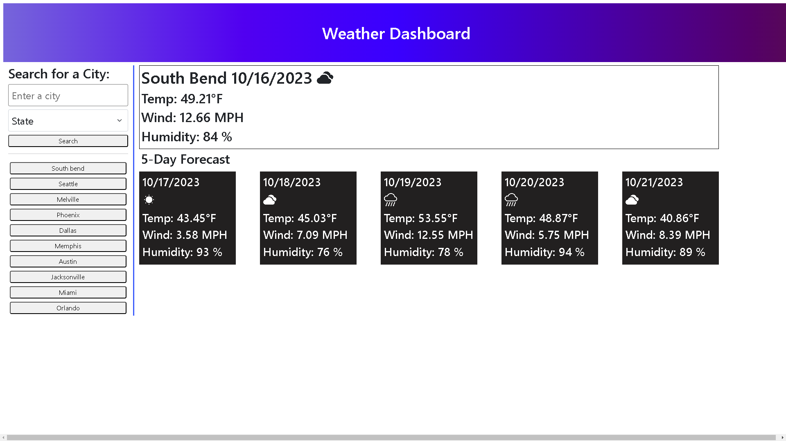

# mod6Server-SideApiChallenge

Weather Dashboard

## Description
The purpose of this project was to create an application to input a city and display a 5 day forecast for that city. This project uses the openweather api to retrieve the latitude and longitude for the entered city, and then retrieve and display the forecast. 

